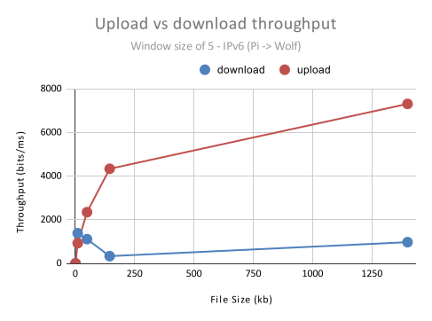
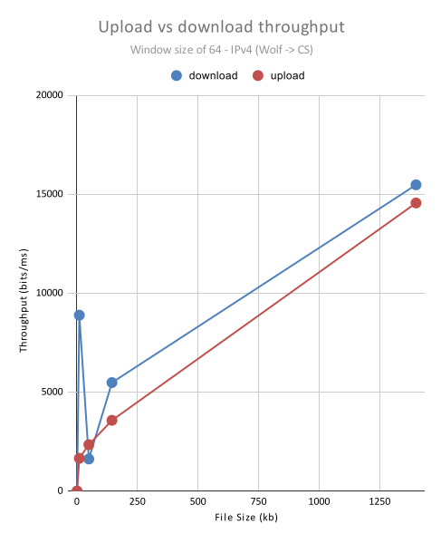
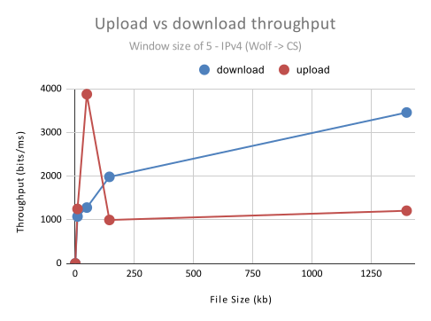
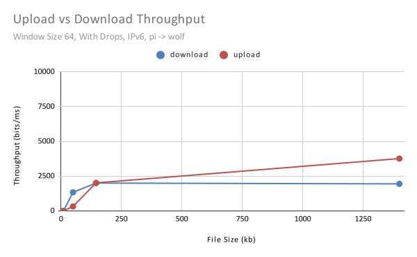
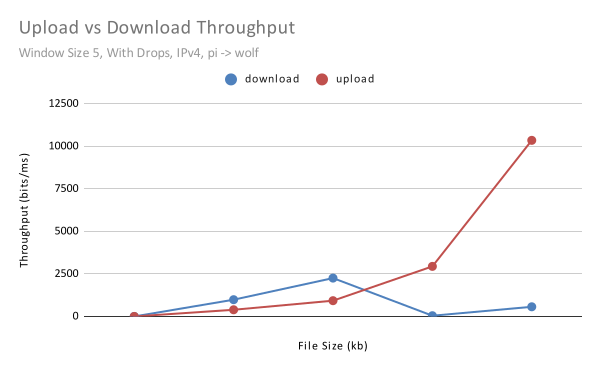
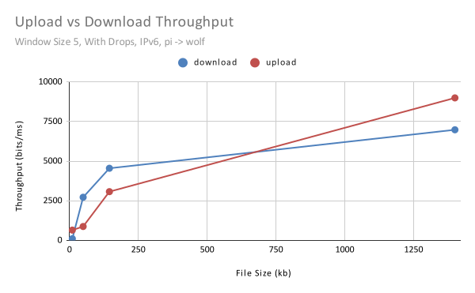
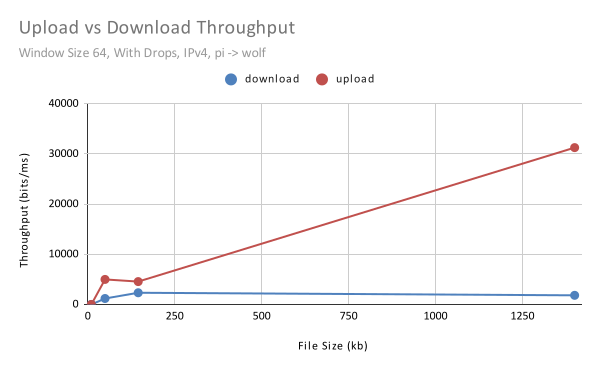

# CSC445P2
Basic TFTP file transfer program. Supports upload and download, choosing between IPV4 and IPV6 UDP datagrams. Implements sliding window. 

# Packet Structure

Packets are structured according to IETF RFC 1350. Data is encrypted very simply with XOR. Each session begins with a random key exchange between Server and Client that is used for encryption.
Only octet transmission is supported.

# Sliding Window

We implemented the sliding window using a Semaphore. The Semaphore has a number of permits equal to the sliding window size. We make a queue of packetThreads,
and initially dequeue a number of them equal to the sliding window size. The threads are responsible for sending their respective Datagram Data packets, and then release
their permits upon receival of an ACK. The sliding window moves (packetThreads are dequeued) as permits are released.

# Timeouts

We use the Exponentially Weighted Moving Average (EWMA) to calculate socket timeout values. 

# Graphs

